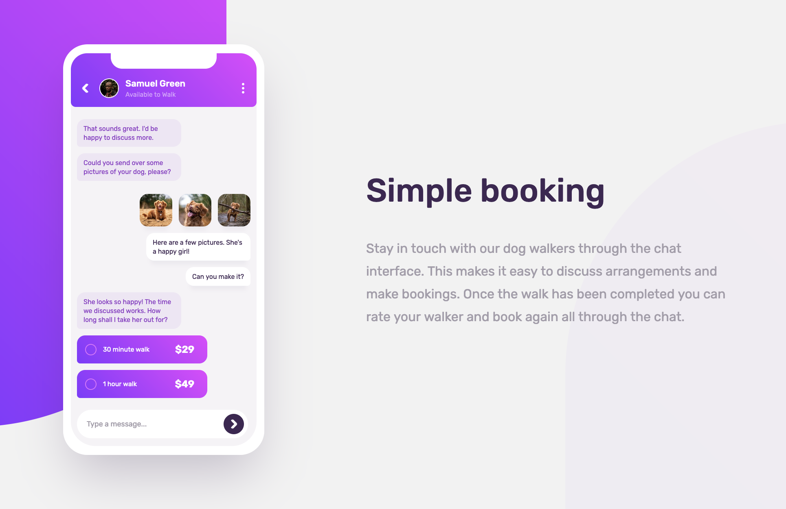

# Frontend Mentor - Chat app CSS illustration solution

This is a solution to the [Chat app CSS illustration challenge on Frontend Mentor](https://www.frontendmentor.io/challenges/chat-app-css-illustration-O5auMkFqY). Frontend Mentor challenges help you improve your coding skills by building realistic projects. 

## Table of contents

- [Frontend Mentor - Chat app CSS illustration solution](#frontend-mentor---chat-app-css-illustration-solution)
  - [Table of contents](#table-of-contents)
  - [Overview](#overview)
    - [The challenge](#the-challenge)
    - [Screenshot](#screenshot)
    - [Links](#links)
  - [My process](#my-process)
    - [Built with](#built-with)
    - [What I learned](#what-i-learned)
  - [Author](#author)

## Overview

### The challenge

Users should be able to:

- View the optimal layout for the component depending on their device's screen size

### Screenshot

### Links

- Solution URL: [GitHub](https://github.com/jakegodsall/chat-app-frontend)
- Live Site URL: [Netlify](https://jakegodsall-chat-app.netlify.app/)

## My process

### Built with

- Mobile First Workflow
- HTML5 Semantic Markup
- BEM
- Sass
- 7-1 Sass Architecture

### What I learned

This project has been quite different compared to the ones I am used to. The design is fairly simple, but the main component is built using HTML and CSS rather than using some prebuilt `.svg`.

Although I have not learned any new CSS rules whilst building this project, I believe I have greatly improved upon my understanding of HTML/Sass architecture, specifically using BEM and Sass partials in order to make the design as composible as possible.

## Author

-   Website - [Jake Godsall](https://jakegodsall.com)
-   Frontend Mentor - [@jakegodsall](https://www.frontendmentor.io/profile/jakegodsall)
-   LinkedIn - [@godsalljake](https://www.linkedin.com/in/godsalljake/)